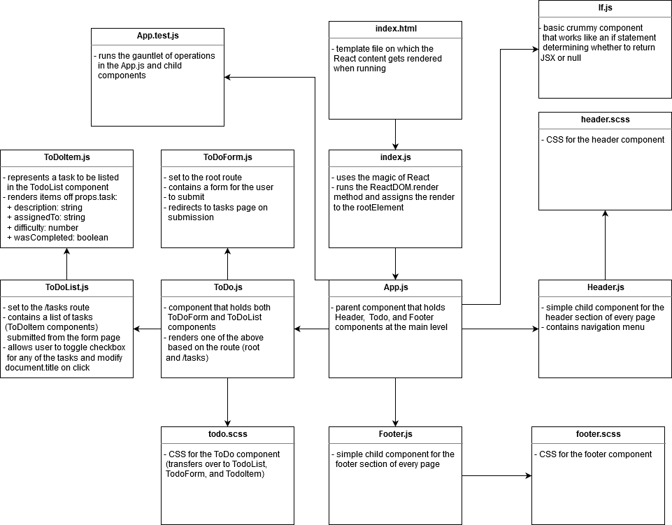

# Lab 26 — Hooks API

## ToDo application, utilizing functional components and the Hooks API

Lab 26 for CF JS 401 Nights

### Author: Earl Jay Caoile

### Links and Resources

#### Submission Reqs

- [submission PR](https://github.com/earljay-caoile-401-advanced-javascript/hooks-todo/pull/1)
- [GitHub actions](https://github.com/earljay-caoile-401-advanced-javascript/hooks-todo/actions)
- [code sandbox](https://codesandbox.io/s/github/earljay-caoile-401-advanced-javascript/hooks-todo/tree/lab-26)

#### Resources

- [HTML Color Picker](https://www.w3schools.com/colors/colors_picker.asp)
- [CSS Layout - Horizontal & Vertical Align](https://www.w3schools.com/csS/css_align.asp)
- [React Bootstrap Navbars](https://react-bootstrap.github.io/components/navbar/)
- [Can I change the checkbox size using CSS?](https://stackoverflow.com/questions/306924/can-i-change-the-checkbox-size-using-css)
- [[ESLint] Feedback for 'exhaustive-deps' lint rule](https://github.com/facebook/react/issues/14920)
- [Viewport vs Percentage Units](https://bitsofco.de/viewport-vs-percentage-units/)

### Documentation

- [React JS Hello World](https://reactjs.org/docs/hello-world.html)
- [SASS](https://sass-lang.com/)
- [Enzyme (Set State)](https://enzymejs.github.io/enzyme/docs/api/ReactWrapper/setState.html)
- [React Font Awesome](https://github.com/FortAwesome/react-fontawesome)
- [JSON Stringify](https://developer.mozilla.org/en-US/docs/Web/JavaScript/Reference/Global_Objects/JSON/stringify)
- [Boostrap Responsive Breakpoints](https://getbootstrap.com/docs/4.1/layout/overview/#responsive-breakpoints)

### Setup

- install node packages locally with `npm i` from the root directory in Terminal
- start the server with `npm start`

### Using the App

- fill out form on the hokme page
- click the submit button
- click the checkbox on tasks page showing your new ToDo task repeatedly to toggle the title
- repeat the above 3 steps to generate a second task
- smile

### UML

